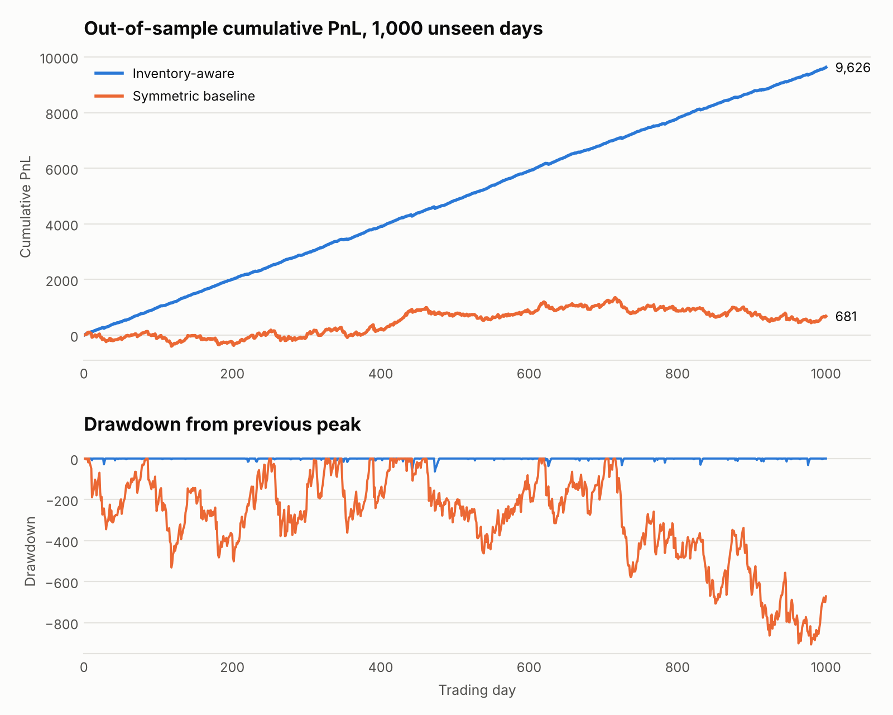
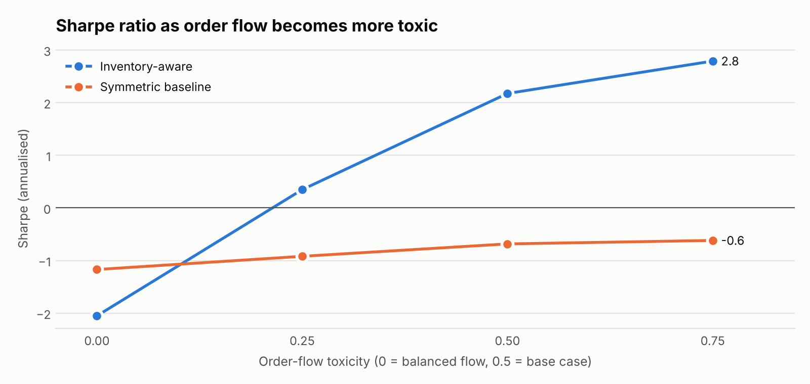

# Market-Making Simulator

A Python simulation of a market maker trading a single instrument in a competitive market. The market includes latency, toxic order flow, news jumps, changing volatility and fees. It tests whether leaning quotes against inventory, using the Avellaneda–Stoikov reservation price, beats naive symmetric quoting. Parameters are tuned on training days only; results come from 1,000 unseen days plus a volatility stress test.

## Headline result

Out of sample, over 1,000 unseen simulated trading days and after fees and close-out costs:

| | Inventory-aware | Symmetric baseline |
|---|---:|---:|
| Mean daily PnL | 9.63 | 0.68 |
| Daily PnL standard deviation | 7.57 | 38.30 |
| Sharpe ratio (annualised) | 20.2 | 0.3 |
| Max drawdown | 63 | 906 |
| Max drawdown, % of capital | 2.5% | 36.2% |
| Losing days | 8.3% | 38.3% |
| Fees paid per day | 2.63 | 3.71 |
| Units filled per day | 130 | 172 |
| Mean absolute inventory | 0.68 | 9.00 |

The naive market maker roughly breaks even, which is what a competitive market should produce. Leaning quotes against inventory turns that into a steady profit, with 93% smaller maximum drawdown and 92% less inventory carried. Capital is the notional the position limit allows: 25 units at a price of 100, so 2,500.



## The model

**Price.** The mid-price follows Brownian motion with an average daily volatility of 2. Each day's volatility is drawn around that average, spread lognormally by 0.4, and the strategy never sees it. News jumps arrive about twice a day, each with a standard deviation of 1. Each day has 200 time steps.

**Order arrival.** Market orders arrive as Poisson processes. The chance that a quote at distance *d* from the mid fills falls as `A·exp(−k·d)`, with A = 140 and k = 1.5, as in Avellaneda & Stoikov (2008).

**Latency.** Quotes are set from the current mid, but the price moves before they can be updated. If the price moves through a stale quote, faster traders take it at once, at the quote's own price. This is the main way real market makers lose money, and every fill in the model happens at the quote's own price, never better.

**Competition.** The rest of the market quotes a common spread, with the same latency. Ordinary orders only reach quotes at or inside the market's best price. The market's spread is set by the **zero-profit condition**: it is the half-spread at which a naive market maker just breaks even, found by bisection, and comes out at 0.196. Any wider and new market makers would undercut it; any tighter and they would lose money.

**Toxic flow.** The market is always in one of three hidden regimes: up-trend, down-trend or flat. The regime is redrawn about five times a day: flat half the time, up or down a quarter each. In an up-trend the price drifts up by 5 per day, buy orders arrive 1.5 times as fast as usual and sell orders half as fast. A market maker who keeps selling into that flow ends up short just as the price rises.

**Costs and limits.** Every fill pays a fee of 0.02, about 10% of the half-spread. Inventory is capped at ±25 units. At the close, any inventory is flattened at the mid, paying 0.25 per unit plus the fee.

## The strategies

Both strategies quote a fraction of the market's half-spread either side of a centre price. A fraction of 1 joins the market's best price; less than 1 improves on it.

**Symmetric baseline.** Centred on the mid, ignoring inventory.

**Inventory-aware.** Centred on the Avellaneda–Stoikov reservation price instead of the mid:

```
r = s − q·γ·σ²·(T − t)
```

Here *s* is the mid, *q* the inventory, *γ* the risk aversion, *σ* the volatility the strategy assumes and *T − t* the time left in the day. When long, both quotes shift down, so the bid drops behind the market and stops buying while the ask becomes more competitive. When short, the reverse.

The original paper also gives an optimal *spread*, but that formula assumes no competition. Against rivals quoting a competitive spread it prices itself out of the market: in this model it fills about once a day and loses money at every risk aversion tested. So, as in practice, the spread is set relative to the market and only the skew comes from the model.

## Method

1. **Set up the market (seed 0).** Find the zero-profit spread.
2. **Calibrate (training data only, seed 1).** Each strategy's parameters are chosen by Sharpe ratio on 500 training days. The spread fraction was searched from 0.5 to 1.25 and γ from 0.002 to 0.2. Both strategies chose to join the market's best price (fraction 1.0); quoting behind it mostly attracts stale-quote fills and loses money. The inventory-aware strategy chose γ = 0.02, inside the search range.
3. **Freeze.** The strategies keep these settings, including the volatility they assume.
4. **Test out of sample (seed 2).** Both strategies run on 1,000 days they have never seen. They get identical random draws, so the comparison isn't simulation noise.
5. **Stress test (seed 3).** Volatility rises 50%. The market re-prices its spread to the new zero-profit level, 0.229, as a competitive market would. The strategies keep their trained settings and are not told volatility has changed.
6. **Sensitivity.** The out-of-sample test is repeated at four levels of order-flow toxicity, with the market re-pricing its spread each time.

## Stress and sensitivity

| Stress: volatility +50% | Inventory-aware | Symmetric baseline |
|---|---:|---:|
| Mean daily PnL | 5.90 | -0.56 |
| Sharpe ratio (annualised) | 7.9 | -0.2 |
| Max drawdown | 73 | 1,782 |
| Losing days | 22.7% | 40.0% |

The inventory-aware strategy stays profitable when volatility jumps, but its Sharpe ratio falls from 20.2 to 7.9 because its skew still assumes the old volatility.



**The skew only pays when order flow is informative.** With balanced flow (toxicity 0), the inventory-aware strategy loses money: Sharpe −1.7 against −0.4 for the baseline. Skewing then costs edge for no benefit, because inventory carries no information about where the price is going. As flow becomes more one-sided, inventory becomes a signal of the hidden trend, and leaning against it pays more.

## Why the Sharpe ratio is still high

An earlier version of this model reported a Sharpe ratio of 28.6. Investigating why, I found it was missing latency, filled skewed quotes at a better price than they offered, and let rivals quote unrealistically wide. Fixing all three brought it to 20.2, and the naive baseline now breaks even, as competition theory predicts.

What remains is a genuine feature of market making: many small, independent trades with inventory kept close to zero. Top market makers do even better: Virtu Financial's 2014 IPO filing showed [one losing day in 1,238 trading days](https://qz.com/186209/the-high-frequency-trading-firm-thats-about-to-go-public-only-had-one-day-of-trading-losses-in-four-years). The absolute level here still depends on the synthetic market's parameters. The robust result is relative: the same market and the same spread, with 93% smaller drawdown from the skew alone.

## Limitations

- **Synthetic prices.** Nothing is fitted to real market data. The natural next step is to estimate A, k, volatility and the competitive spread from real order-book data.
- **Rivals don't skew.** The market's spread is set by naive market makers. Against rivals who also manage inventory, spreads would be tighter and the edge smaller.
- **No queue position.** A quote at the best price fills at the full arrival rate. On a real exchange, time priority means sharing those fills with rivals at the same price.
- **Poisson arrivals.** Real order flow clusters. A Hawkes process would be more realistic.
- **One instrument, one unit per fill.** No hedging across correlated assets, and no large orders that sweep several price levels.

## Running it

```
pip install -r requirements.txt
python run.py       # market set-up, calibration, out-of-sample and stress results -> results/results.json
python charts.py    # charts -> results/
python -m pytest    # model tests
```

The seeds are fixed, so every number above reproduces exactly.
